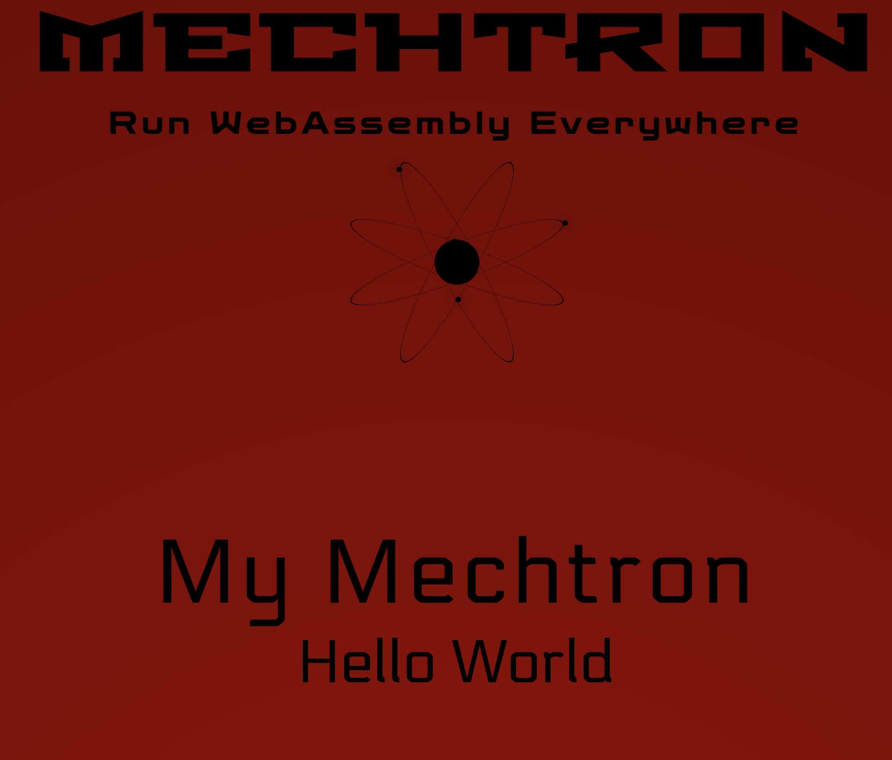

# LESSON 2 -- HELLO USING A TEMPLATE

In our last lesson we generated the Hello World app, but lets' face it a textual response of `Hello World` is pretty ugly.  Wouldn't it be nice if it returned some rich HTML instead? 
That's what we are going to do in THIS lesson: "Beautify the Hello World" app.   

>Make sure you have the LATEST version of starlane installed (this requires version 0.3.3)  There's no harm in running this again:
```bash
cargo install starlane
cargo install cosmic-cli
```

## ARTIFACTS
This lesson will make use of the Mechtron ArtifactAPI which will allow us to pull a template file from the bundle. 

## GENERATE A NEW MECHTRON PROJECT
```bash
cargo generate --git https://github.com/mechtronium/mechtron-skel.git --name hello-with-template 
```

## HANDLEBARS
We are going to be using [Handlebars](https://crates.io/crates/handlebars) as our templating engine.

First lets add handlebars to our `Cargo.toml` file:

```toml 
[dependencie]
handlebars = "4.3.5"
```

## CACHING
Open `src/lib.rs` and take a look at how MyMechtron is defined.   Notice that `type Cache` is set to () meaning empty.  That's because we don't need to cache anything
when we are simply returning the Hello World text, but now we want to cache the template. 

```rust
impl<P> Mechtron<P> for MyMechtron<P> where P: Platform + 'static,
{
    type Skel = MechtronSkel<P>;
    type Cache = (); 
    type State = ();

    fn restore(skel: Self::Skel, cache: Self::Cache, _state: Self::State) -> Self {
        MyMechtron { skel }
    }
}
```

Change type Cache and implement the `cache` method:

```rust

impl<P> Mechtron<P> for MyMechtron<P> where P: Platform + 'static,
{
    type Skel = MechtronSkel<P>;
    type Cache = Arc<Handlebars<'static>>; // changed to Arc<Handlebars<'static>>
    type State = ();

    fn restore(skel: Self::Skel, cache: Self::Cache, _state: Self::State) -> Self {
        MyMechtron { skel }
    }

    /// override the cache method in order to do the work of cachine before
    /// this mechtron is created.
    fn cache(skel: Self::Skel) -> Result<Option<Self::Cache>, P::Err> {

        /// retrieve index.html from the same bundle that serves this mechtrons config
        let template = skel.raw_from_bundle("template/index.html")?;
        let template = String::from_utf8((**template).clone())?;

        let mut handlebars = Handlebars::new();

        handlebars.register_template_string("template", template);

        Ok(Some(Arc::new(handlebars)))
    }
}
```

In order to invoke the caching we have to modify MyMechtronFactory's methods:


```rust
pub struct MyMechtronFactory
{
    pub cache: HashMap<Point,Arc<Handlebars<'static>>>,
}

impl MyMechtronFactory
{
    pub fn new() -> Self {
        Self {
            cache: HashMap::new(),
        }
    }
}

impl<P> MechtronFactory<P> for MyMechtronFactory
where
    P: Platform + 'static,
{
    fn name(&self) -> String {
        "hello-with-template".to_string()
    }

    fn new(&mut self, skel: MechtronSkel<P>) -> Result<(), P::Err> {
        let template = MyMechtron::cache(skel.clone())?.ok_or("expected template")?;
        // the Factory actually stores all Caches and States:
        self.cache.insert(skel.details.stub.point.clone(), template);
        Ok(())
    }

    fn lifecycle(&self, skel: MechtronSkel<P>) -> Result<Box<dyn MechtronLifecycle<P>>, P::Err> {
        let cache = self
            .cache
            .get(&skel.details.stub.point)
            .ok_or("expecting template")?
            .clone();
        // notice we now send the 'cache' when we restore the Mechtron:
        Ok(Box::new(MyMechtron::restore(skel, cache, ())))
    }

    fn handler(&self, skel: MechtronSkel<P>) -> Result<Box<dyn DirectedHandler>, P::Err> {
        let cache = self
            .cache
            .get(&skel.details.stub.point)
            .ok_or("expecting template")?
            .clone();
        Ok(Box::new(MyMechtron::restore(skel, cache, ())))
    }
}
```

## RENDERING
Now it's time to modify the Hello World code so it returns a rendered template:

```rust

pub struct MyMechtron<P>
where
    P: Platform + 'static,
{
    skel: MechtronSkel<P>,
    // be sure to add a reference to cache in the struct:
    cache: Arc<Handlebars<'static>>,
}


#[handler_sync]
impl <P> MyMechtron<P>
where
    P: Platform + 'static,
{
    #[route("Http<Get>")]
    pub fn hello(&self, ctx: InCtx<'_, ()>) -> Result<Substance, MyErr> {
        /// we simply call the render method with the two parameters this template expects `title` & `message`
        let render = self.cache.render("template", &json!({"title": "My Mechtron", "message": "Hello World"}) )?;
        Ok(Substance::Text(render))
    }
}
```

## CREATE THE TEMPLATE
Now we need to bundle the actual template:

Paste the following html into the file: `bundle/template/index.html`  It will now be deployed with the rest of the bundle:

```html
<!DOCTYPE html>
<html lang="en" >
<head>
    <meta charset="UTF-8">
    <title>MECHTRON</title>
    <link rel="preconnect" href="https://fonts.googleapis.com">
    <link rel="preconnect" href="https://fonts.gstatic.com" crossorigin>
    <link href="https://fonts.googleapis.com/css2?family=Economica:ital@1&family=Electrolize&family=Gemunu+Libre:wght@200;400&family=Geo:ital@1&family=Jura:wght@500&family=Keania+One&family=Open+Sans:ital,wght@1,300&family=Share:ital@1&family=Stalinist+One&family=Zen+Dots&display=swap" rel="stylesheet">

    <style>
        html{
            height: 100%;
            background-color: black;
        }

        body{
            background: radial-gradient(ellipse at bottom, #990000 0%, #660000 100%);
            height: 100%;
            margin: 0;
        }


        #title > h1 {
            text-align: center;
            font-family: 'Economica', sans-serif;
            font-family: 'Stalinist One', cursive;
            margin-left: auto;
            margin-right: auto;
            margin-top: 0;
            margin-bottom: 0;
            font-size: 85px;

        }

        #title > h2 {
            text-align: center;
            font-family: 'Zen Dots', cursive;
            margin-left: auto;
            margin-right: auto;
            margin-top: 0;
            margin-bottom: 0;

            font-size: 32px;
        }

        #title > h2 > span {
            -webkit-animation: glow 5s ease-in-out infinite alternate;
            -moz-animation: glow 5s ease-in-out infinite alternate;
            animation: glow 5s ease-in-out infinite alternate;
        }


        p {
            text-align: center;
            font-family: 'Electrolize', sans-serif;
            margin-left: auto;
            margin-right: auto;
            margin-top: 0;
            margin-bottom: 0;

            font-size: 24px;

        }


        #atom {
            transform: scale(1.2, 1.2);
            overflow: hidden;
            display: block;
            width: 256px;
            height: 256px;
            border: 1px;
            margin-left: auto;
            margin-right: auto;
        }

        #atom > div {
            border-radius: 50%;
            border: 1px solid #000;
            transform-style: preserve-3d;
            transform: rotateX(80deg) rotateY(20deg);
            position: absolute;
            left: 50%;
            top: 50%;
            margin-left: -100px;
            margin-top: -100px;
        }
        #atom > div:first-of-type:after {
            content: "";
            position: absolute;
            height: 40px;
            width: 40px;
            background: #000;
            border-radius: 50%;
            transform: rotateX(-80deg) rotateY(0);
            box-shadow: 0 0 25px #000;
            -webkit-animation: nucleus_ 2s infinite linear;
            animation: nucleus_ 2s infinite linear;
            left: 50%;
            top: 50%;
            margin-top: -20px;
            margin-left: -20px;
        }
        #atom > div:nth-of-type(2) {
            transform: rotateX(-80deg) rotateY(20deg);
        }
        #atom > div:nth-of-type(2) > div,
        #atom > div:nth-of-type(2) > div:after {
            -webkit-animation-delay: -0.5s;
            animation-delay: -0.5s;
        }
        #atom > div:nth-of-type(3) {
            transform: rotateX(-70deg) rotateY(60deg);
        }
        #atom > div:nth-of-type(3) > div,
        #atom > div:nth-of-type(3) > div:after {
            -webkit-animation-delay: -1s;
            animation-delay: -1s;
        }
        #atom > div:nth-of-type(4) {
            transform: rotateX(70deg) rotateY(60deg);
        }
        #atom > div:nth-of-type(4) > div,
        #atom > div:nth-of-type(4) > div:after {
            -webkit-animation-delay: -1.5s;
            animation-delay: -1.5s;
        }
        #atom > div > div {
            width: 200px;
            height: 200px;
            position: relative;
            transform-style: preserve-3d;
            -webkit-animation: trail_ 2s infinite linear;
            animation: trail_ 2s infinite linear;
        }
        #atom > div > div:after {
            content: "";
            position: absolute;
            top: -5px;
            box-shadow: 0 0 12px #000;
            left: 50%;
            margin-left: -5px;
            width: 5px;
            height: 5px;
            border-radius: 50%;
            background-color: #000;
            -webkit-animation: particle_ 2s infinite linear;
            animation: particle_ 2s infinite linear;
        }

        @-webkit-keyframes trail_ {
            from {
                transform: rotateZ(0deg);
            }
            to {
                transform: rotateZ(360deg);
            }
        }

        @keyframes trail_ {
            from {
                transform: rotateZ(0deg);
            }
            to {
                transform: rotateZ(360deg);
            }
        }
        @-webkit-keyframes particle_ {
            from {
                transform: rotateX(90deg) rotateY(0deg);
            }
            to {
                transform: rotateX(90deg) rotateY(-360deg);
            }
        }
        @keyframes particle_ {
            from {
                transform: rotateX(90deg) rotateY(0deg);
            }
            to {
                transform: rotateX(90deg) rotateY(-360deg);
            }
        }

        @-webkit-keyframes glow {
            0%, 80%, 100% {
                text-shadow: 0 0 0 transparent;
            }
            90% {
                text-shadow: 0 0 10px #00099;
            }
        }
        @keyframes glow{
            0%, 80%, 100% {
                text-shadow: 0 0 0 transparent;
            }
            90% {
                text-shadow: 0 0 10px #0003;
            }
        }


        @-webkit-keyframes nucleus_ {
            0%, 100% {
                box-shadow: 0 0 0 transparent;
            }
            50% {
                box-shadow: 0 0 5px #00099;
            }
        }
        @keyframes nucleus_ {
            0%, 100% {
                box-shadow: 0 0 0 transparent;
            }
            50% {
                box-shadow: 0 0 5px #0009;
            }
        }


        #payload {
            position: fixed;
            text-align: center;

            font-family: 'Electrolize', sans-serif;

            left: 50%;
            top: 50%;
            transform: translate(-50%,-50%);
        }
        #title{
            display: block;
            font-weight: 300;
            font-size: 96px;
            text-align: center;

            font-family: 'Electrolize', sans-serif;
            letter-spacing: 5px;
        }

        #message{
            font-weight: 200;
            font-size: 64px;

            font-family: 'Electrolize', sans-serif;
            z-index: 1;
        }

        footer {
            position: fixed;
            bottom: 0;
            left: 50%;
            transform: translateX(-50%);
            margin-bottom: 16px;

        }
    </style>

</head>
<body>
<!-- partial:index.partial.html -->
<section id="title">
    <h1>MECHTRON</h1>
    <h2>Run <span>WebAssembly</span> Everywhere</h2>
</section>

<section id="atom">
    <div>
        <div></div>
    </div>
    <div>
        <div></div>
    </div>
    <div>
        <div></div>
    </div>
    <div>
        <div></div>
    </div>
</section>

<section id="payload">
    <span id="title">{{ title }}</span>
    <span id="message">{{ message }}</span>
</section>


<footer>
    <p>This page was served by a Mechtron</p>
</footer>

</body>
</html>
```

## TEST
Okay now that you have coded it up, lets see if we can get actual results!

First start up starlane from your terminal:

```bash
starlane
```

Next we bundle our Mechtron:

```bash
make all
```

There is an install script that comes packaged open it up and change the version to be published to 2.0.0:

```
create? repo<Repo>;
create? repo:{{project-name}}<BundleSeries>;
publish ^[ bundle.zip ]-> repo:{{project-name}}:1.0.0;
#                                                          Change version from 1.0.0 to 2.0.0!
create! localhost<Mechtron>{ +config=repo:{{project-name}}:2.0.0:/config/my-mechtron.mechtron };
exit;
```

You can then execute this script from the command line

```bash
cosmic < install.script
```

Now point your browser to [http://localhost:8080](http://localhost:8080) and you should see THIS:




